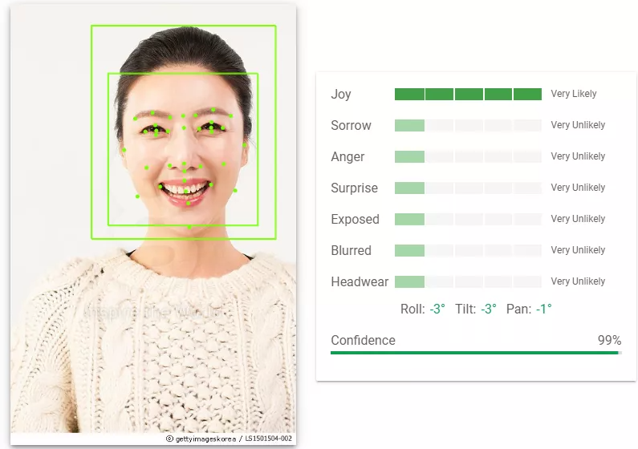

# 감정 읽는 뇌 
(이미지를 읽고 이해하는 것을 인간의 뇌와 유사한 방식으로 비유)

## [목차]
[1. 개요](#1-개요)

[2. 활용한 인공지능 API](#2-활용한-인공지능-api)

[3. 웹 페이지 구축](#3-웹-페이지-구축)

- [3.1 웹 개발](#31-웹-개발)
- [3.2 Google Cloud Vision API 호출](#32-google-cloud-vision-api-호출)
- [3.3 API 기타 버튼](#33-api-기타-버튼)

[4. 프로젝트 결과](#4-프로젝트-결과)

[5. 문제점과 교훈](#5-문제점과-교훈)

## 1. 개요
> 이번 프로젝트에서는 Google Cloud Vision API를 활용하여 가져온 이미지에서
인물의 감정을 분석하여 감정을 표현하거나 이해하기 어려운 사람들에게 유용한 정보를 도출할 수 있는
이 기술을 통해 서비스를 구현하고자 한다.

### 1.1 사용자의 사례
감정을 표현하기 서툰 어린이나 장애를 가진 사람들을 대상으로 웹 페이지를 구상하려고 한다.
그 중 예시로 자폐 스펙트럼 장애를 가진 사람들을 보자면 자폐증은 인구 1000명당 1-2명 발병하는 증상으로 
1990년대와 2000년대에 급격하게 증가하여 이들은 다른 사람들과 정서적 교류에 어려움을 겪고 있는 경우가 많아
도움이 되고자 시작하게 되었다.

## 2. 활용한 인공지능 API

Google Cloud에서 제공하는 Cloud Vision API을 사용하고자 한다.
- 얼굴을 인식하여 감정을 분석하는 작업 수행

## 3. 웹 페이지 구축
### 3.1 웹 개발
웹 페이지를 만들고 사용자가 이미지를 업로드할 수 있도록 인터페이스를 설계한다.
이미지를 넣을 수 있는 창과 분석 상태를 출력하는 창을 구성해 사용자가 쉽게
잘 볼 수 있도록 한다.

### 3.2 Google Cloud Vision API 호출 후 응답 처리
사용자가 제공한 이미지를 Cloud Vision API로 전송하여 
이미지 분석을 요청한 후 API에서 반환한 응답을 처리하여 이미지에 대한 분석 결과와
얼굴 감지 정보 등을 사용자에게 숫자로 표시한다.

### 3.3 기타 버튼
각종 버튼을 만들어 사용자가 이용하기 쉽게 각종 정보를 적었다.

## 4. 프로젝트 결과
Cloud Vision API를 웹 사이트 안에 성공적으로 연결하였고 불러온 사진이 화면에 나타나여 분석하기 버튼을 누르면
위 칸에 얼굴의 어느 부분을 감지하였는지 아래 칸에 그에 대한 분석 결과를 숫자로 표시하였다.
웹 사이트를 전체적으로 친근한 느낌으로 표현하기 위해 초록색과 노랑색을 사용하여 심플하게 디자인을 하였다.
이로 인해 감정을 이해하기 어려운 사람들이 이 분석을 통해 어떤 표정이 나올 때 이런 감정을 표현할 수 있는지에 대해 알 수 있다.

## 5. 문제점과 교훈
이 프로젝트를 진행하면서 API를 어떻게 연결하는지가 제일 까다로웠고 버튼이나 상자를 어디에 두어야 사용자가 보기 편리할지도 
생각해야해서 쉽게 표현하기 어려운 점도 많았다.
하지만 스스로 이 어려운 문제점을 하나씩 해결해가다보니 우리의 생각이나 실력이 확실히 변화되었다고 느꼈다.
